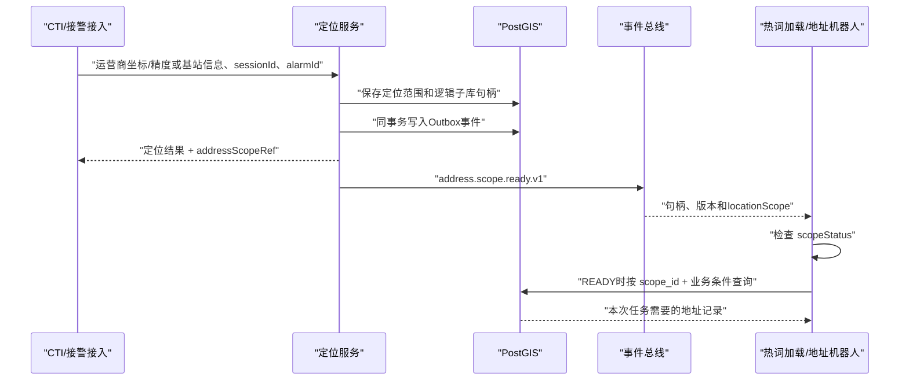

# 逻辑地址子库接入使用手册

## 1. 一句话说明

定位服务从全局地址库中圈定本次电话的可查询范围，返回`scopeId`。下游收到`address.scope.ready.v1`事件后，用`scopeId`按自身任务条件查询本次范围内的地址；同一事件还携带最终标准化中心和半径供地址机器人做距离计算。下游不需要重新计算邻区，更不要求一次读取全部记录。

## 2. `scopeId`是什么

`scopeId`是逻辑子库句柄，不是数据库连接、文件地址或一页查询结果。

它固定绑定：

- 本次定位结果ID；
- 本次定位版本；
- 本次使用的全局地址库存版本；
- 已经计算完成的`hard_area/search_area`；
- 创建时间和有效期。
- 空间命中状态`scopeStatus`，但不保存地址总数。

地址记录仍保存在全局地址表。查询逻辑视图时，PostGIS根据句柄绑定的范围返回其中的AOI、POI、LOI和建筑，因此每通电话可以拥有不同的逻辑子库而不复制地址数据。

## 3. 标准接入流程



## 4. 十分钟快速接入

### 第一步：取得环境参数

从实施方取得以下信息：

- RabbitMQ主机、端口、vhost、专属队列和消费账号；
- 数据库主机、端口、库名、SSL方式和专属只读账号；
- 可读schema：`dispatch_assist`和`ai`；
- 视图：`logical_address_scope_item`；
- 逻辑子库TTL和当前库存版本；
- 如使用REST，取得Base URL及认证方式。

密码和密钥只能通过配置中心或密钥服务取得，不能从MQ消息读取。

### 第二步：订阅句柄事件

事件类型固定为：

```text
address.scope.ready.v1
```

从事件`data.addressScopeRef.scopeId`取得句柄。使用外层CloudEvent的`id`或`data.eventId`做幂等；两者在当前版本中相同。

同时读取`data.addressScopeRef.scopeStatus`：

- `READY`：范围内至少存在一条候选地址，可以继续查询；
- `EMPTY`：句柄有效但结果为空，无须访问明细视图，记录结果后正常ACK；
- 字段缺失或`UNKNOWN`：属于兼容旧消息，允许查询视图确认。

地址机器人还应读取`data.locationScope`：中心经纬度、半径、坐标系、范围类型和定位方式均来自生成该`scopeId`的最终定位版本。它可用于计算候选地址到参考中心的距离和业务排序，但`scopeId`才是空间过滤的权威条件。热词服务不需要距离时可忽略该字段。历史消息可能缺少`locationScope`，此时仍可仅凭`scopeId`查询。

RabbitMQ队列已由定位组件创建。Spring下游应关闭`RabbitAdmin`主动声明（例如设置`spring.rabbitmq.dynamic=false`），只通过`@RabbitListener`监听分配给自己的现有队列，并使用手动ACK；不要声明同名exchange、queue或binding。

### 第三步：读取逻辑子库

内部服务首选直接查询数据库。正常业务查询必须同时带`scopeId`和本服务当前需要的条件，例如地址机器人只查询AOI、POI中的当前名称线索：

```sql
SELECT inventory_id,
       source_type,
       source_id,
       standard_name,
       short_name,
       full_address,
       aoi_name,
       road_name,
       hit_level,
       longitude,
       latitude
FROM dispatch_assist.logical_address_scope_item
WHERE scope_id = CAST(:scopeId AS uuid)
  AND source_type IN ('AOI', 'POI')
  AND (standard_name ILIKE :namePattern
       OR full_address ILIKE :namePattern)
ORDER BY inventory_id;
```

下游不需要把逻辑子库完整搬入本地。只有热词加载等确实需要遍历全部地址词面的任务，才查询`logical_address_scope_hotword_item`并采用JDBC流式读取；不得使用`SELECT *`、`queryForList/fetchall`或在数据库客户端渲染数万行作为正常链路。

### 第四步：各下游自行处理

- 热词加载服务读取地址名称和地址文本，再自行完成词面生成、去重、Top-K、权重和ASR装载；
- 地址机器人读取名称、类型、地址、AOI和道路等字段，并可结合事件中的`locationScope`计算距离或排序，再按自己的提取规则处理；
- 定位服务只保证范围和原始地址记录，不参与这两类后处理。

## 5. 上游触发定位样例

人工圆形模式示例：

```http
POST /api/v1/location/resolutions
Content-Type: application/json
```

```json
{
  "requestId": "scope-e2e-001",
  "sessionId": "call-session-001",
  "alarmId": "alarm-001",
  "sourceType": "CTI_COORDINATE",
  "baseStationCoordinate": {
    "longitude": 118.3341998168,
    "latitude": 23.3493569342,
    "coordinateSystem": "WGS84",
    "accuracyMeters": 10,
    "capturedAt": "2026-08-04T14:06:37.000+08:00"
  },
  "radiusMeters": 2000
}
```

成功响应中必须包含：

```json
{
  "success": true,
  "code": "OK",
  "data": {
    "resolutionId": "ad018390-9628-4d02-be61-999173461b14",
    "sessionId": "call-session-001",
    "positioningMethod": "BASE_STATION_RADIUS_CIRCLE",
    "searchLongitude": 118.3341998168,
    "searchLatitude": 23.3493569342,
    "searchRadiusMeters": 2000,
    "version": 1,
    "addressScopeRef": {
      "scopeId": "992488ca-d04e-4ad3-bd62-f4eb8a82ef47",
      "locationResolutionId": "ad018390-9628-4d02-be61-999173461b14",
      "locationResolutionVersion": 1,
      "inventoryVersion": "REAL_AI_TILED_1M_V1",
      "scopeStatus": "READY"
    }
  }
}
```

需要使用基站库邻区融合时不传`radiusMeters`，但`baseStationCoordinate`必须在配置容差内匹配全局基站库锚点。`radiusMeters`表示地址检索范围，不表示报警人的定位精度。

## 6. 句柄事件样例

```json
{
  "specversion": "1.0",
  "id": "542171ec-e893-37b2-a246-73275c44a82d",
  "source": "ids-location-address-scope",
  "type": "address.scope.ready.v1",
  "time": "2026-08-04T14:06:37.304+08:00",
  "subject": "992488ca-d04e-4ad3-bd62-f4eb8a82ef47",
  "data": {
    "eventId": "542171ec-e893-37b2-a246-73275c44a82d",
    "eventType": "address.scope.ready.v1",
    "schemaVersion": "1.0",
    "occurredAt": "2026-08-04T14:06:37.304+08:00",
    "requestId": "scope-e2e-001",
    "sessionId": "call-session-001",
    "alarmId": "alarm-001",
    "addressScopeRef": {
      "scopeId": "992488ca-d04e-4ad3-bd62-f4eb8a82ef47",
      "locationResolutionId": "ad018390-9628-4d02-be61-999173461b14",
      "locationResolutionVersion": 1,
      "inventoryVersion": "REAL_AI_TILED_1M_V1",
      "scopeStatus": "READY"
    },
    "locationScope": {
      "centerLongitude": 118.3341998168,
      "centerLatitude": 23.3493569342,
      "radiusMeters": 2000.0,
      "coordinateSystem": "WGS84",
      "shapeType": "CIRCLE",
      "positioningMethod": "BASE_STATION_RADIUS_CIRCLE",
      "evidenceLevel": "L1_BASE_STATION_COORDINATE_ONLY"
    },
    "itemsPath": "/api/v1/address-scopes/992488ca-d04e-4ad3-bd62-f4eb8a82ef47/items",
    "queryPath": "/api/v1/location/resolutions/ad018390-9628-4d02-be61-999173461b14/address-scope/query"
  }
}
```

消息中不会出现完整地址数组、定位多边形、数据库密码、手机号、录音或报警对话。`locationScope`只是小体量定位范围元数据，不是报警人真实坐标，也不能代替`scopeId`重新执行空间圈选。

## 7. 失败处理

| 情况 | 接入方处理 |
|---|---|
| 重复收到同一`eventId` | 返回成功或忽略，不重复产生业务副作用 |
| 数据库暂时不可用 | 本地有限次退避重试；超过阈值进入消费端失败队列 |
| `scopeStatus=EMPTY` | 这是已确认的有效空范围；无须查询明细，记录后正常ACK |
| `scopeStatus=UNKNOWN`或旧消息查询返回0条 | 检查TTL、库存版本及权限；必要时使用REST区分不存在或过期 |
| REST返回`INVALID_REQUEST` | 检查句柄、游标、类型或有效期，不要继续使用错误游标 |
| 消息晚于TTL到达 | 不处理过期句柄，告警并联系定位服务排查事件积压 |
| 消费处理失败 | 不修改逻辑子库；保留`eventId/scopeId`后重试自己的处理流程 |

## 8. 当前实测基线

开发环境曾使用100万条全局地址、2公里定位圆实测：生成定位结果、逻辑句柄和Outbox约294.69 ms；一个示例句柄命中2,904条；数据库取前101条执行约4.793 ms；REST连续两页各100条且无重复。这是早期开发基线。

167联调环境于2026-08-05进一步验证：

- 旧版完整链路重启后坐标到`scopeId`响应79.591 ms，预热后9.765 ms；
- 预热后Outbox创建到RabbitMQ confirm 279.737 ms，坐标请求到双队列消息均可读取409 ms；
- 同一`scopeId`由两个只读账号均查得35,985条，完整双队列、双数据库账号验证658 ms；
- V16整改后，`READY`示例句柄命中35,985条，`EMPTY`示例句柄命中0条；HTTP响应、数据库状态和MQ事件三处一致；
- 主链路用短路`EXISTS`判断是否为空：命中范围执行0.333 ms，空范围执行0.340 ms，均使用GiST空间索引；
- 在35,985条逻辑子库上按AOI/POI和名称条件查询前100条，数据库执行46.883 ms；不需要先搬运全部地址；
- Java自动化测试54项通过、0失败。

2026-08-06已在167环境部署包含`locationScope`的当前版本并重新验证：坐标到`scopeId`为11.249 ms；Outbox最终为`PUBLISHED`、重试0次；热词队列由在线消费者实时接收，地址机器人队列中的完整CloudEvent可读取且通过Schema字段校验；两个数据库只读账号对同一`scopeId`均查询到35,985条。脚本完成MQ投递、消息体、双账号总数和分类数量等全部自检用时1,467 ms，该时间不是定位接口或下游单次业务查询耗时。

这些数据用于证明链路可用，不直接构成生产SLA。

## 9. 完成标准

接入方完成以下事项才算接入成功：

1. 能接收并校验事件；
2. 能按`eventId`幂等；
3. 能凭`scopeId`读取数据库视图或遍历REST全部分页；
4. 能正确区分AOI、POI、LOI和建筑；
5. 能处理重复、无结果、过期和依赖不可用；
6. 通过06号联调验收手册并留存结果。
