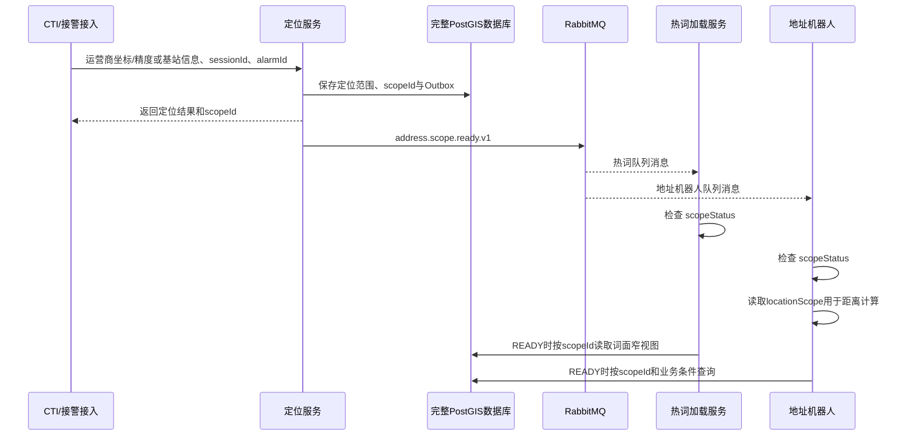

# 定位逻辑子库下游联调说明

## 1. 联调结论

定位服务是MQ生产者。每次定位完成后，它向一个direct exchange发布一条持久化CloudEvent；RabbitMQ复制到两个独立队列。事件同时包含`scopeId`和生成该句柄时使用的最终标准化`locationScope`。热词服务与地址机器人各消费自己的队列，再使用消息中的`scopeId`和各自数据库只读账号直接查询完整PostGIS数据库。



## 2. 热词服务需要的信息

| 类别 | 参数 |
|---|---|
| MQ | `192.168.173.167:5672`、AMQP 0-9-1、vhost `/location` |
| 队列 | `location.address-scope.hotword.v1` |
| MQ账号 | 服务器`.env`中的`LOCATION_RABBITMQ_HOTWORD_USER/PASSWORD` |
| 数据库 | `192.168.173.167:15432/dispatch_assist`、PostgreSQL协议 |
| DB账号 | `.env`中的`LOCATION_DB_HOTWORD_USER/PASSWORD` |

## 3. 地址机器人需要的信息

| 类别 | 参数 |
|---|---|
| MQ | `192.168.173.167:5672`、AMQP 0-9-1、vhost `/location` |
| 队列 | `location.address-scope.addressbot.v1` |
| MQ账号 | 服务器`.env`中的`LOCATION_RABBITMQ_ADDRESSBOT_USER/PASSWORD` |
| 数据库 | `192.168.173.167:15432/dispatch_assist`、PostgreSQL协议 |
| DB账号 | `.env`中的`LOCATION_DB_ADDRESSBOT_USER/PASSWORD` |

两个消费者不需要声明或绑定exchange，也不能消费对方队列。队列已由定位组件创建，消费者只需连接、订阅、手动ACK。

Java/Spring下游可使用以下最小配置（队列名按服务二选一）：

```yaml
spring:
  rabbitmq:
    host: 192.168.173.167
    port: 5672
    virtual-host: /location
    username: ${LOCATION_MQ_USERNAME}
    password: ${LOCATION_MQ_PASSWORD}
    dynamic: false
    listener:
      simple:
        acknowledge-mode: manual
        prefetch: 20

location:
  address-scope-queue: location.address-scope.hotword.v1
```

```java
@RabbitListener(queues = "${location.address-scope-queue}")
public void onScopeReady(
        String body,
        Channel channel,
        @Header(AmqpHeaders.DELIVERY_TAG) long deliveryTag) throws IOException {
    // 1. 校验CloudEvent并按eventId幂等
    // 2. EMPTY直接记录完成；READY取scopeId按业务条件查PostGIS
    channel.basicAck(deliveryTag, false);
}
```

不要在下游定义同名`Queue/Exchange/Binding`并主动重建拓扑；`dynamic: false`用于关闭Spring的主动声明。监听容器对现有队列的被动检查和消费可使用当前队列读取权限。

## 4. 消息样例

```json
{
  "id": "542171ec-e893-37b2-a246-73275c44a82d",
  "specversion": "1.0",
  "source": "ids-location-address-scope",
  "type": "address.scope.ready.v1",
  "time": "2026-08-05T14:06:37.304+08:00",
  "subject": "992488ca-d04e-4ad3-bd62-f4eb8a82ef47",
  "datacontenttype": "application/json",
  "data": {
    "eventId": "542171ec-e893-37b2-a246-73275c44a82d",
    "eventType": "address.scope.ready.v1",
    "schemaVersion": "1.0",
    "requestId": "scope-e2e-001",
    "sessionId": "call-session-001",
    "alarmId": "alarm-001",
    "addressScopeRef": {
      "scopeId": "992488ca-d04e-4ad3-bd62-f4eb8a82ef47",
      "locationResolutionId": "ad018390-9628-4d02-be61-999173461b14",
      "locationResolutionVersion": 1,
      "inventoryVersion": "REALISTIC_AI_SOURCE_V1",
      "scopeStatus": "READY"
    },
    "locationScope": {
      "centerLongitude": 116.33,
      "centerLatitude": 39.92,
      "radiusMeters": 2000.0,
      "coordinateSystem": "WGS84",
      "shapeType": "CIRCLE",
      "positioningMethod": "BASE_STATION_RADIUS_CIRCLE",
      "evidenceLevel": "L1_BASE_STATION_COORDINATE_ONLY"
    }
  }
}
```

`id`用于消费幂等，`data.addressScopeRef.scopeId`用于查库。地址机器人使用`data.locationScope`的中心和半径做距离计算或排序，但不得自行换半径重新圈选；精确范围始终以`scopeId`为准。热词服务可忽略该字段。2026-08-06之前的历史消息可能缺少`locationScope`，仍应按`scopeId`正常处理。`EMPTY`记录空结果后可直接ACK；`READY`只有业务查询和处理完成后才ACK。临时故障应NACK并重试，无法处理的消息进入各自`.dlq`。

## 5. 按scopeId读取本次逻辑子库

先查看句柄状态：

```sql
SELECT scope_status, inventory_version, expires_at
FROM dispatch_assist.logical_address_scope_summary
WHERE scope_id = CAST(:scopeId AS uuid);
```

地址机器人按当前条件查询，不要先加载全部记录：

```sql
SELECT inventory_id, source_type, standard_name, full_address,
       aoi_name, road_name, longitude, latitude
FROM dispatch_assist.logical_address_scope_item
WHERE scope_id = CAST(:scopeId AS uuid)
  AND source_type IN ('AOI', 'POI')
  AND (standard_name ILIKE :namePattern
       OR full_address ILIKE :namePattern)
ORDER BY inventory_id
LIMIT :limit;
```

只有热词服务确实需要遍历全部地址词面时，才使用窄字段视图流式读取。第一页不带游标条件：

```sql
SELECT inventory_id, source_type,
       standard_name, short_name, full_address,
       aliases, aoi_name, road_name
FROM dispatch_assist.logical_address_scope_hotword_item
WHERE scope_id = CAST(:scopeId AS uuid)
ORDER BY inventory_id
LIMIT :batchSize;
```

后续页增加`inventory_id > CAST(:lastInventoryId AS uuid)`，传上一批最后一个UUID。推荐`batchSize=500～2000`并使用JDBC只读事务和`fetchSize`，避免一次把万级结果全部装入内存。REST只在无法直连数据库时使用。

## 6. 完整数据库读取范围

下游只读账号还可直接查询：

- `dispatch_assist.*`：定位结果、逻辑子库、统一地址读模型、基站和邻区；
- `ai.aoi_*`：AOI层级和出入口；
- `ai.poi_*`：建筑、楼层、房间、附属信息；
- `ai.loi_road`：道路数据。

数据库账号设置了`default_transaction_read_only=on`并只授予`SELECT/USAGE`。如需新建缓存表或写入处理结果，应使用下游自己的数据库，不得写入定位库。

## 7. 联调步骤

1. 网络放通下游到`192.168.173.167:5672`和`15432`；
2. 分别交付该下游的MQ与DB账号，不共享账号；
3. 下游连接自己的队列并保持等待；
4. 调用定位接口产生一个新`scopeId`；
5. 验证两个队列各收到一条同`eventId/scopeId`消息；
6. 两个下游各自按`scopeId`查询，分类数和总数应一致；
7. 重放同一事件，验证幂等；模拟失败，验证消息不会被误ACK。

## 8. 生产迁移注意项

- RabbitMQ和PostGIS只开放到下游业务网段，禁止公网访问；
- 密码进入生产密钥管理系统并定期轮换；
- 每个下游继续使用独立账号、独立队列；
- 监控主队列积压、死信数、Outbox重试数和数据库连接数；
- 当前部署用于联调，生产环境需接入备份、高可用和TLS。

## 9. 167联调实测结果

2026-08-05执行`bash e2e-smoke.sh`通过：

- 最终版本API坐标到`scopeId`：重启后79.591 ms，预热后9.765 ms；
- Outbox创建到RabbitMQ confirm：重启后1,065.278 ms，预热后279.737 ms；
- 预热后从坐标请求到两个队列均能直接读到消息：409 ms；
- 完成双队列、双数据库账号和分类数量验证：658 ms；
- 两个数据库只读账号按该`scopeId`均返回35,985条；
- 分类为AOI 1,410、BUILDING 1,847、LOI 5,956、POI 26,772；
- Outbox最终为`PUBLISHED`、重试0次，真实消息满足CloudEvent字段契约；
- 客户端可访问`18080/15432/5672`，不能直接访问仅回环绑定的`15672`。

以上为一次功能联调证据，不作为生产P95/P99 SLA。

### V16整改补充验证

- 新句柄明确返回`scopeStatus=READY/EMPTY`；空范围仍产生可追踪句柄和MQ事件，但下游无需查询明细；
- READY示例`a2871b13-fa5e-4c46-bf5d-a3fba43612ee`命中35,985条；EMPTY示例`61416cee-8eea-4f48-b415-6d3203bd9f21`命中0条；
- HTTP、数据库摘要视图和MQ事件中的状态一致；
- 创建句柄时只做短路`EXISTS`，READY/EMPTY数据库执行分别为0.333/0.340 ms，均使用GiST空间索引；
- 35,985条逻辑范围内按AOI/POI和名称条件取前100条，数据库执行46.883 ms；不需要一次性读取全部地址；
- Java自动化测试当前累计54项通过、0失败。

### 地址机器人范围元数据版本验证

2026-08-06已部署JAR SHA-256为`D40C03B1E86A91DB7F703E47EC66BBA68E0EA239DB043CDAE6EFF8352D3FEC4E`，以CTI坐标和2公里半径执行真实端到端验证：

- API坐标到`scopeId`为11.249 ms，`scopeId=a4bf1dc4-f343-40a8-b2f4-b27610db5bee`；
- Outbox为`PUBLISHED`、重试0次，消息中的`locationScope`与HTTP最终搜索中心、半径和定位方式一致；
- 热词队列由在线消费者实时接收；地址机器人队列消息体完成CloudEvent、`scopeId`和`locationScope`校验；
- 两个只读账号对同一句柄均返回35,985条，分类数量一致；
- 全部验收动作耗时1,467 ms，其中包含MQ轮询、消息体检查、双账号完整计数和分类统计，不代表定位接口或下游单次业务查询耗时。
